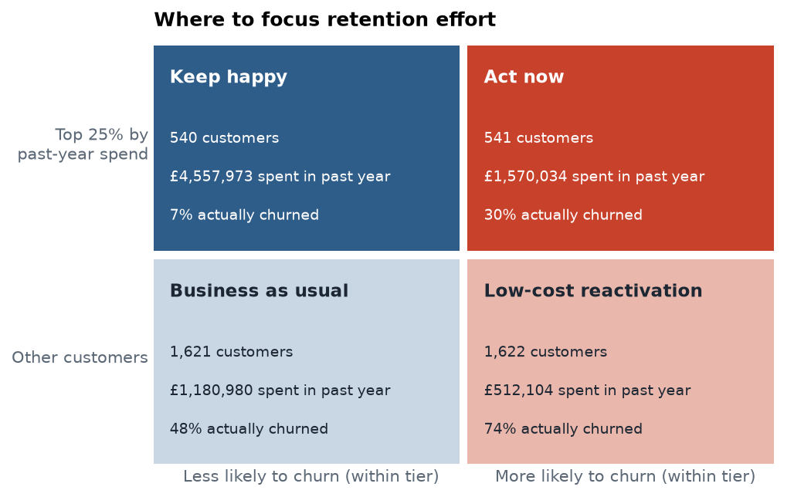
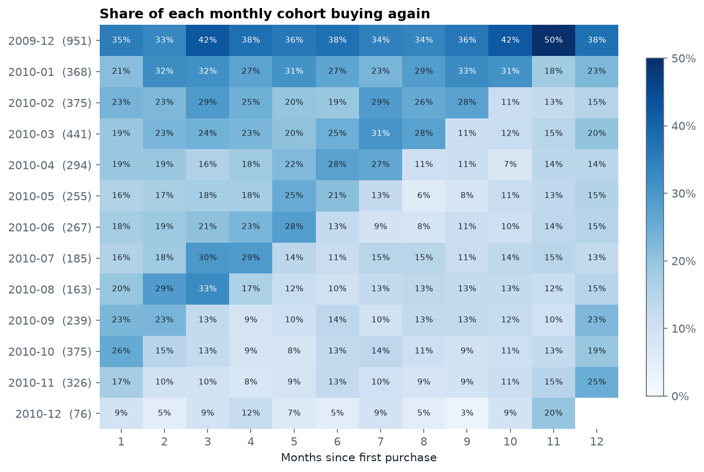
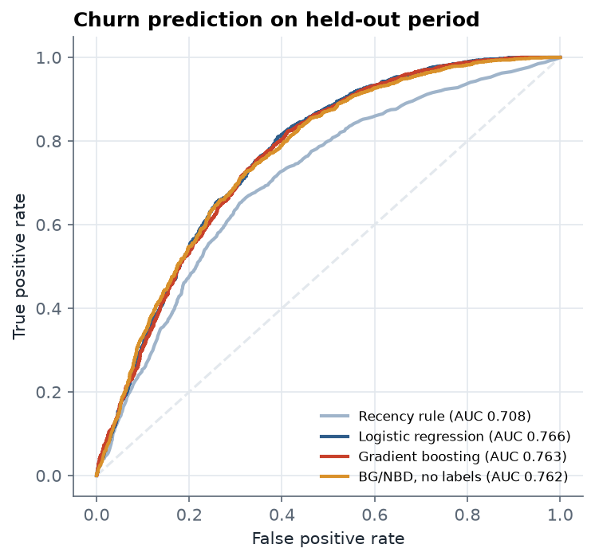
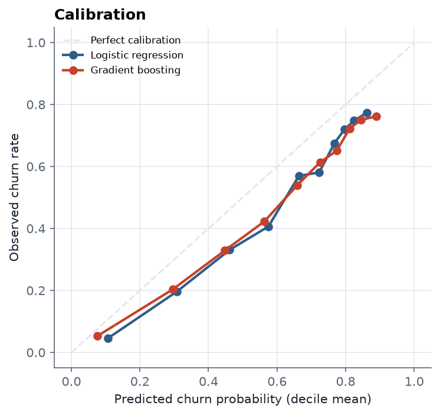
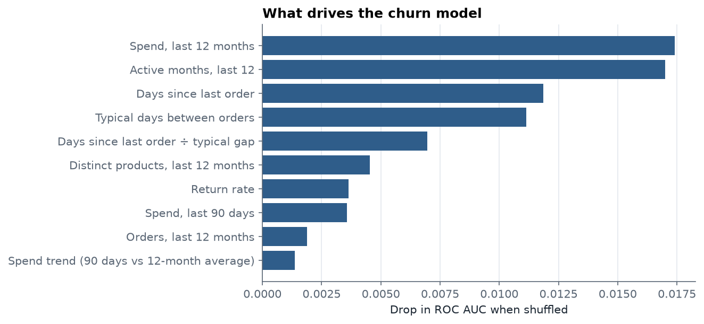
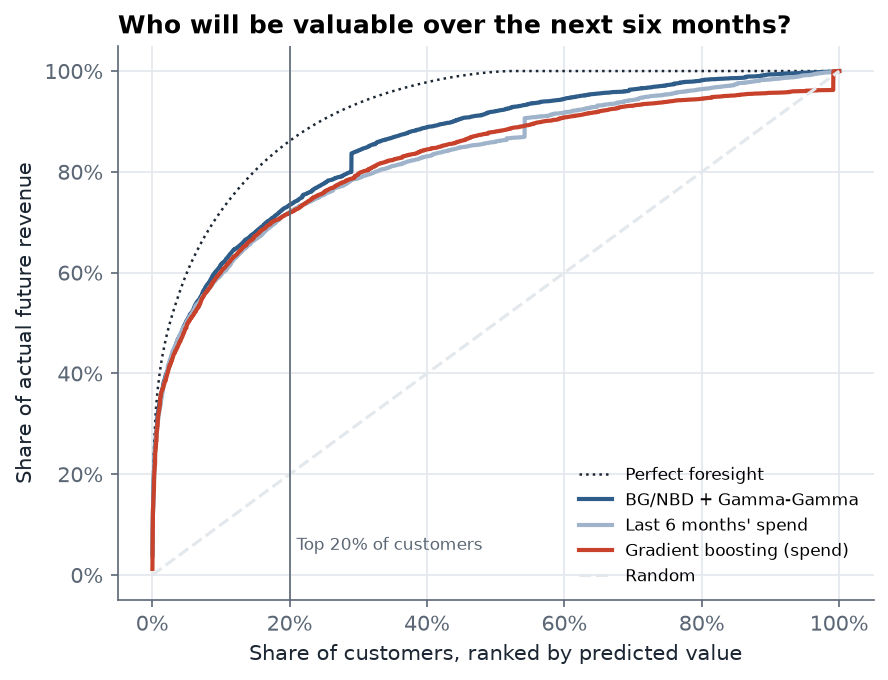

# Customer churn and lifetime value

Which customers are about to stop buying, and which ones are worth the most effort to keep? This project answers both questions for a real UK online retailer, using two years of transactions, and turns the answers into a simple plan for where to focus retention spending.



## Key findings

- **The churn model finds at-risk customers well before they leave.** On a held-out period it scores a ROC AUC of **0.766**, against **0.708** for the common rule of thumb "flag whoever hasn't ordered recently".
- **Among the best customers, risk is highly concentrated.** Within the top 25% by spend, the half the model flagged as riskier churned at **30%**, compared with **7%** for the other half. Those 541 customers spent **£1.57m** in the previous year, so this is where retention offers will pay back most.
- **A simple probabilistic model predicted future value better than machine learning.** BG/NBD with Gamma-Gamma, which I implemented from the original papers, ranked customers' next-six-month revenue better than both a gradient-boosted model and last-six-months' spend. It needs no labels, and it was almost as good at predicting churn as the supervised models (AUC 0.762).
- **The top 20% of customers produced about 73% of future revenue,** and the model identified them in advance.

## Data

[Online Retail II](https://archive.ics.uci.edu/dataset/502/online+retail+ii) from the UCI Machine Learning Repository (CC BY 4.0): every transaction of a UK gift-ware retailer from December 2009 to December 2011, many of whose customers are wholesalers.

| | |
|---|---|
| Raw rows | 1,067,371 |
| After cleaning | 794,165 |
| Customers | 5,875 |

Cleaning removes rows with no customer ID, postage, fees and manual adjustments, zero prices and exact duplicates. Returns are kept as negative revenue, so customer value is net of returns.

## Approach

### 1. Retention by cohort



Typically only about **21%** of new customers buy again the following month. The December 2009 cohort looks unusually loyal because it includes everyone who was already a customer when the data starts.

### 2. Predicting churn

A customer counts as **churned** if they make no purchase in the 90 days after a given date. The model only sees data from before that date.

- **Design without leakage.** Features are built at 16 monthly cutoffs from March 2010 to June 2011, producing 55,665 training rows. The test set is a later cutoff, 1 September 2011, with 4,324 active customers. No training label overlaps the test period, and a unit test checks that changing future data never changes a feature.
- **Features.** Recency, frequency and spend over several windows, typical days between orders, days since the last order relative to that typical gap, spend trend, return rate, product breadth and country.
- **Models.** Logistic regression (with log transforms), gradient boosting, the recency rule as a baseline, and BG/NBD as a model trained without labels.

| Model | ROC AUC | PR AUC | Lift, top 10% |
|---|---|---|---|
| Recency rule (baseline) | 0.708 | 0.679 | 1.46 |
| **Logistic regression** | **0.766** | **0.720** | **1.53** |
| Gradient boosting | 0.763 | 0.715 | 1.51 |
| BG/NBD, no labels | 0.762 | 0.720 | 1.50 |

<p>


</p>

Gradient boosting didn't beat logistic regression. With customer-level features that already summarise behaviour well, the relationships are close to monotonic, so the simpler, more explainable model is the one I'd deploy.

**Seasonality affects calibration.** The model predicts 61% churn on average, but 50% actually churned. The test window runs from September to November, the retailer's busiest season, when fewer customers lapse. Ranking isn't affected, but churn *rates* for budgeting should be recalibrated per season. I tried adding seasonal features, but with only two years of data they overcorrected.



### 3. Predicting lifetime value

For each customer, the BG/NBD model estimates how often they will buy and the probability they are still active. The Gamma-Gamma model estimates how much they will spend per order, shrinking customers with little history towards the average. I implemented both from the original papers with SciPy (`src/churnclv/clv.py`), including a test that recovers known parameters from simulated data.

Models are fitted on data up to 9 June 2011, then compared with the 4,941 customers' actual revenue over the following six months.

| Model | Rank correlation | Revenue captured by top 20% | Predicted total vs actual £4.56m |
|---|---|---|---|
| **BG/NBD + Gamma-Gamma** | **0.625** | **73.5%** | £3.66m (−20%) |
| Last six months' spend | 0.569 | 72.0% | £3.20m (−30%) |
| Gradient boosting | 0.566 | 71.7% | £7.16m (+57%) |



The gradient-boosted model learned from the same season a year earlier, when the business was growing faster, and badly overestimated totals. All methods underestimate the Christmas peak to some extent.

### 4. From models to decisions

Customers are split into the top 25% by past-year spend and everyone else, then into the riskier and safer halves of each group. Risk is ranked *within* each group because high spenders rarely churn. A single risk threshold would flag almost none of them and miss the customers who matter most.

| Segment | Customers | Spend, past year | Actually churned | Suggested action |
|---|---|---|---|---|
| Act now | 541 | £1.57m | 30% | Personal outreach, account management, targeted offers |
| Keep happy | 540 | £4.56m | 7% | Service quality; avoid unnecessary discounts |
| Low-cost reactivation | 1,622 | £0.51m | 74% | Automated win-back emails |
| Business as usual | 1,621 | £1.18m | 48% | Standard marketing |

## Run it yourself

```bash
git clone https://github.com/mohsinnadeems/customer-churn-clv.git
cd customer-churn-clv
python -m venv .venv && source .venv/bin/activate
pip install -e ".[dev]"

churnclv download          # fetches the dataset from UCI into data/
churnclv run               # runs everything and writes reports/metrics.json and reports/figures/
pytest                     # 16 tests
```

If the download fails, get the dataset manually from the [UCI page](https://archive.ics.uci.edu/dataset/502/online+retail+ii), put `online_retail_II.xlsx` in `data/`, and run `churnclv run`. It runs on a laptop in a few minutes, and no API keys or paid services are needed.

## Project structure

```
src/churnclv/
  data.py       download, load (xlsx, csv, parquet), clean
  features.py   point-in-time features and churn labels
  churn.py      models, metrics, calibration, permutation importance
  clv.py        BG/NBD and Gamma-Gamma, implemented from the papers
  cohorts.py    monthly retention matrix
  plots.py      charts
  run.py        end-to-end pipeline and CLI
tests/          16 tests including leakage and parameter-recovery checks
reports/        metrics.json and figures from the latest run
```

## Limitations

- One retailer with many wholesale customers, so results won't transfer directly to consumer retail.
- A single test period; a production system would validate across several and monitor for drift.
- Segment actions are suggestions. Their actual impact should be measured with a controlled experiment, holding out a random group from each campaign.

## Licence

Code: MIT. Data: Online Retail II by Daqing Chen, UCI Machine Learning Repository, CC BY 4.0.
